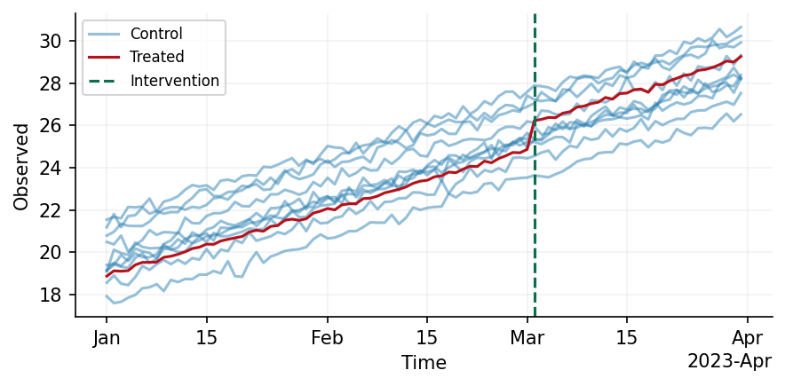

# Welcome to Causal Validation

Causal Validation is a library designed to validate and test your causal models. To
achieve this, we provide functionality to simulate causal data, and vaildate your model
through a placebo test. 

## Data Synthesis

Data Synthesis in Causal Validation is a fully composable process whereby a set of
functions are sequentially applied to a dataset. At some point in this process we also
induce a treatment effect. Any of these functions can be parameterised to either have
constant parameter values across all control units, or a value that varies across
parameters. To see this, consider the below example where we simulate a dataset whose
trend varies across each of the 10 control units.

```python
from causal_validation import Config, simulate
from causal_validation.effects import StaticEffect
from causal_validation.plotters import plot
from causal_validation.transforms import Trend
from causal_validation.transforms.parameter import UnitVaryingParameter
import numpy as np
from scipy.stats import norm

# Treatment assignment matrix
D = np.zeros((90, 11))  # 90 time points, 11 units
D[60:, -1] = 1  # Last unit treated after 60 time points

cfg = Config(treatment_assignments=D)

# Simulate the base observation
base_data = simulate(cfg)

# Apply a linear trend with unit-varying intercept
intercept = UnitVaryingParameter(sampling_dist = norm(0, 1))
trend_component = Trend(degree=1, coefficient=0.1, intercept=intercept)
trended_data = trend_component(base_data)

# Simulate a 5% lift in the treated unit's post-intervention data
effect = StaticEffect(0.05)
inflated_data = effect(trended_data)

plot(inflated_data)
```



## Model Validation

Once a dataset has been synthesised, we may wish to validate our model using a placebo
test. In Causal Validation this is straightforward and can be accomplished in
combination with AZCausal by the following.

```python
from azcausal.estimators.panel.sdid import SDID
from causal_validation.estimator.utils import AZCausalWrapper
from causal_validation.validation.placebo import PlaceboTest

model = AZCausalWrapper(model=SDID())
result = PlaceboTest(model, inflated_data).execute()
result.summary()
```
